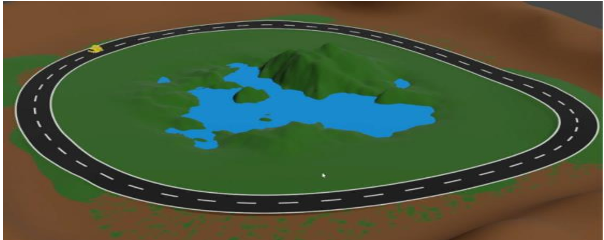

# Blender-Araba-Animasyon
# Blender Araba Modelleme Projesi 🚗

Bu proje, Mersin Üniversitesi Bilgisayar Mühendisliği - Bilgisayar Grafiği dersi için hazırlanmış düşük poligonlu (low-poly) bir araç modelidir.

## 🛠 Kullanılan Teknolojiler
* **Yazılım:** Blender
* **Teknikler:** Low-poly modelleme, Material shading
* **Dosya:** `arabamodelleme.blend`

## 📸 Önizleme

